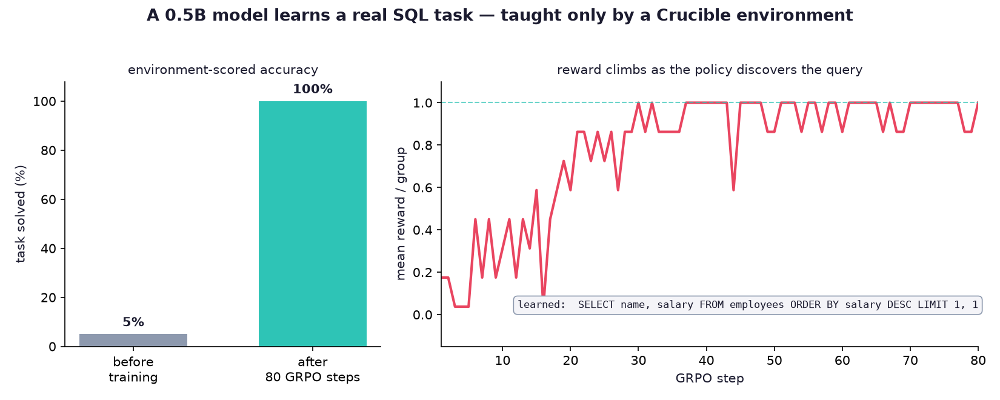
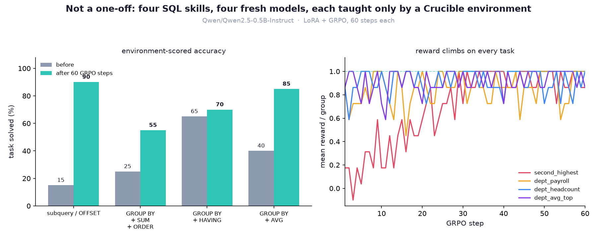

# Crucible

> **Provisional codename.** A *crucible* is both the vessel that contains and the
> trial that transforms — which is exactly what an environment does to an agent.
> The name may change.

**Crucible turns any real software into a trainable, gradable world for AI agents.**

Wrap a CLI, a database, a codebase, or an API in a few lines and it becomes an
*environment*: an agent can be run through it, scored on real outcomes, and — the
part nobody else has — its whole episode **replayed deterministically**, so every run
is reproducible and every reward is auditable.

```python
from crucible import rollout, replay

traj = rollout(my_env, my_agent, seed=0)   # run the agent, record the episode
report = replay(fresh_env, traj)           # re-run and verify it byte-for-byte
assert report.ok
traj.save("episode.trajectory.json")       # the artifact leaves memory
```

## Why this exists

The frontier of AI moved off pre-training. Models now improve by **doing** —
reinforcement learning in environments — and the field agrees on the bottleneck:
*"RL environments are the key bottleneck to the next wave of AI progress, but big
labs are locking them down."* Environments are the **training data of 2026**, and
there is no open, easy way to *make* them. The open ecosystem has a hub (Prime
Intellect) and a training stack (TRL, verifiers, prime-rl) — it does not have a great
open **authoring layer**. That's the seam Crucible fills. The full argument is in
[`docs/VISION.md`](docs/VISION.md).

## It actually trains a model

Not a toy: a `SQLTaskEnv` used *directly* as a GRPO reward — no labels, no hand-written
reward code — took `Qwen2.5-0.5B-Instruct` from **5% → 100%** on a real SQL task in 80
steps on a single laptop GPU. The model discovered the query itself, guided only by the
environment.



And it's **not one lucky task** — a fresh model trained on four *distinct* SQL skills
improved on every one (subquery, `SUM`, `HAVING`, `AVG`). The method trains, not the
task. Full runs + how to reproduce: [`examples/results/`](examples/results/README.md).



## Install

```bash
pip install crucible-rl              # the zero-dependency core, Python 3.11+
pip install "crucible-rl[train]"     # + the RL stack, to reproduce the GRPO run
pip install -e ".[dev]"              # or hack on it from a clone
```

## Quickstart (60 seconds)

Run the built-in demo — three real worlds, each forged and replayed:

```bash
python -m examples.demo
```

```
=== CodeTaskEnv - fix the bug so the test goes green (the reward writes itself) ===
  steps: 2   total reward: +0.90   replay: reproduced OK
```

Inspect a saved episode from the terminal:

```bash
crucible show episode.trajectory.json      # summary + integrity check
```

## Core concepts

Three nouns, two verbs — the whole core is ~180 lines and imports only the standard
library.

| Piece | What it is |
| --- | --- |
| **`Environment`** | Real software wrapped with `reset(seed)` / `step(action)` |
| **`Agent`** | Anything with `act(observation) -> action` (scripted, search, an LLM) |
| **`Trajectory`** | The replayable episode record (seed, observations, actions, rewards) |
| **`rollout`** | Drives an agent through an environment and records a Trajectory |
| **`replay`** | Re-runs a Trajectory against a fresh environment and verifies it |

How each of these works internally — the rollout loop, the replay verifier, the
determinism contract, digests, the on-disk format — is documented to junior-dev
detail in **[`docs/ARCHITECTURE.md`](docs/ARCHITECTURE.md)**.

## Write your own environment

Wrap software you already have; implement two methods and (optionally) a digest:

```python
from crucible.env import Environment, StepResult

class ReverseStringEnv(Environment):
    def __init__(self, target: str):
        self.target = target
    def reset(self, seed: int):
        return {"task": f"reverse: {self.target!r}"}
    def step(self, action):
        correct = str(action) == self.target[::-1]
        return StepResult(
            observation={"you_said": str(action)},
            reward=1.0 if correct else -0.1,
            done=correct,
            info={"correct": correct},
        )
```

The rules that make an environment *replayable* (determinism, JSON-serializable
observations, verifiable reward, digests) and a full worked example are in
[`docs/ARCHITECTURE.md`](docs/ARCHITECTURE.md) §7.

## The example environments (`crucible/envs/`)

| Env | Shows |
| --- | --- |
| `GuessEnv` | A fully deterministic game — the clean proof that replay reproduces an episode exactly |
| `SQLTaskEnv` | Wrapping **real SQLite** — reward is programmatic and verifiable (run the query, compare the rows) |
| `CodeTaskEnv` | The SWE-agent shape — **the test suite is the reward function** (edit files, grader runs, green is the reward) |
| `CommandEnv` | Wrap any **command-line tool** — the agent emits a command, reward is exit-0 + stdout match (sandboxed, registerable) |
| `TerminalEnv` | A **stateful shell session** — commands accumulate state across steps (mkdir here, write there); reward is a goal over the workdir |
| `HttpTaskEnv` | Wrap a **recorded HTTP service** (VCR/cassette) — the agent finds the right request; deterministic and registerable |

## The CLI

- `crucible show <file>` — summarize a saved episode (env, seed, steps, reward,
  fingerprint) and integrity-check it.
- `crucible replay <file>` — rebuild the environment from the registry and **re-run**
  the episode, confirming it reproduces (or printing the mismatches). Works for
  registered environments; see [ARCHITECTURE §6c](docs/ARCHITECTURE.md).

## Project layout

```
crucible/            the zero-dependency core + example environments
  env.py             the Environment contract (reset/step, determinism, digest)
  trajectory.py      the replayable record (JSON, versioned save/load, fingerprint)
  rollout.py         rollout() records; replay() re-runs and verifies
  registry.py        register/make envs by name (powers `crucible replay`)
  reward.py          Rubric — partial-credit rewards from weighted checks
  sandbox.py         run a grader/command in a subprocess (safe for untrusted code)
  export.py          flatten trajectories to {prompt, completion, reward} / JSONL
  cli.py             the `crucible` command
  envs/              GuessEnv, SQLTaskEnv, CodeTaskEnv, CommandEnv
examples/            example agents + the runnable demo (not packaged)
tests/               the suite (100% coverage, enforced in CI)
docs/                VISION (why), ARCHITECTURE (how), BACKLOG (what's next)
```

## Development

```bash
pip install -e ".[dev]"
pytest                     # runs the suite; pyproject enforces --cov-fail-under=90
```

CI (`.github/workflows/ci.yml`) runs the same gate on Python 3.11–3.13. Every change
ships with tests and moves the docs in the same commit (see
[`CONVENTIONS.md`](CONVENTIONS.md)).

## Status & roadmap

**V1 (the MVP) is complete**, and the repo is **public under MIT** with tests, CI,
and a code-owner +1 required to merge. Author → run → grade → replay → persist, as a
real tool, on one code path, 100% coverage. Progress at a glance (full "how to build
it" detail for every item is in **[`docs/BACKLOG.md`](docs/BACKLOG.md)**):

**Built**

- [x] Core — `Environment` contract, `Trajectory`, `rollout`, `replay`
- [x] Deterministic replay that verifies the whole episode (observations, rewards, digests)
- [x] Trajectory persistence (versioned format) + `crucible show` / `crucible replay` CLI
- [x] Environment registry (`register` / `make`) for rebuild-from-a-file replay
- [x] Sandboxed grading — subprocess (`SubprocessSandbox`) or container (`DockerSandbox`), fail-closed
- [x] Rubrics — partial-credit rewards from weighted checks
- [x] Environments: `GuessEnv`, `SQLTaskEnv`, `CodeTaskEnv`, `CommandEnv`, `TerminalEnv`, `HttpTaskEnv`
- [x] Real git-repo-with-pytest (by composition) — the agent turns real tests green
- [x] Training export — `{prompt, completion, reward}` / JSONL
- [x] TRL adapter — a Crucible environment *as* a GRPO reward function
- [x] verifiers adapter — same bridge for Prime Intellect's stack
- [x] CI + ≥90% coverage gate (Python 3.11–3.13)
- [x] Public (MIT); contributions via PR with green CI + a code-owner +1 required
- [x] Gradio demo app (`space/app.py`) — runs locally (`python space/app.py`)
- [x] **A real GRPO training run** — a 0.5B model learned a SQL task **5% → 100%**
      with a Crucible environment *as* the reward, no labels; **generalizes** across
      four distinct SQL skills ([`examples/results/`](examples/results/README.md))

**Next**

- [ ] Publish to PyPI (`pip install crucible-rl`)
- [ ] Trajectory commons — shareable, auditable trajectory datasets on the Hub
- [ ] Host the demo Space *(app is built; hosting deferred — Hugging Face now
      charges for Gradio Spaces, and a free static/`gradio-lite` port is the fallback)*
- [ ] Learned reward for non-verifiable tasks *(parked — research)*

## What it is *not*

Crucible is **training/eval infrastructure** (the Gymnasium / Prime-Intellect
lineage). Its "verification" is programmatic task-success checking for reward. It is
deliberately **not** a runtime agent-accountability or governance system — a
different field. See [`docs/VISION.md`](docs/VISION.md) §5.

## License & contributing

**MIT** ([`LICENSE`](LICENSE)) — fork it and build. The repo is private for now and
flips to public once the code-grader sandbox lands. Contributions are welcome via
pull request, and every merge needs a maintainer +1 (see
[`CONTRIBUTING.md`](CONTRIBUTING.md)).
